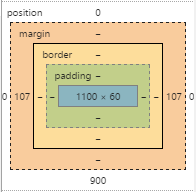

### CSS 박스모델

#### block, inline-block 속성값을 가지는 요소는 박스형태를 말함
#### 박스모델은 아래 4가지 개념으로 설명 가능
- ##### content - 실제 html 태그 내 컨텐츠로써 내용이 차지하는 영역
- ##### padding - 테두리(border)와 컨텐츠 사이의 여백
- ##### border - 박스의 테두리
- ##### margin - 테두리 바깥 여백

### 박스 모델과 관련된 CSS 주요 속성
- #### width & height - 컨텐츠의 너비와 높이를 지정하는 속성
- #### max-width, min-width & max-height, min-height - 너비, 높이의 최대, 최솟값을 지정하는 속성
- #### border - 테두리의 두께, 스타일, 색상을 지정하는 속성
- #### padding (top right bottom left) (top&bottom left&right) - 안쪽 여백의 크기를 정하는 속성
- #### margin (top right bottom left) (top&bottom left&right) - 외부 여백의 크기를 정하는 속성
- #### box-sizing - 너비와 높이의 기준을 어떻게 잡을까에 관한 속성
	- ##### 자세한 사항은 사이트 참고 - https://developer.mozilla.org/ko/docs/Web/CSS/box-sizing
- #### border-radius -테두리를 둥글게 만드는 속성
	- ##### 자세한 사항은 사이트 참고 - https://developer.mozilla.org/ko/docs/Web/CSS/border-radius)
- #### box-shadow - 테두리를 감싼 그림자 효과를 추가합니다.
	- ##### 자세한 사항은 사이트 참고 - https://developer.mozilla.org/ko/docs/Web/CSS/box-shadow  